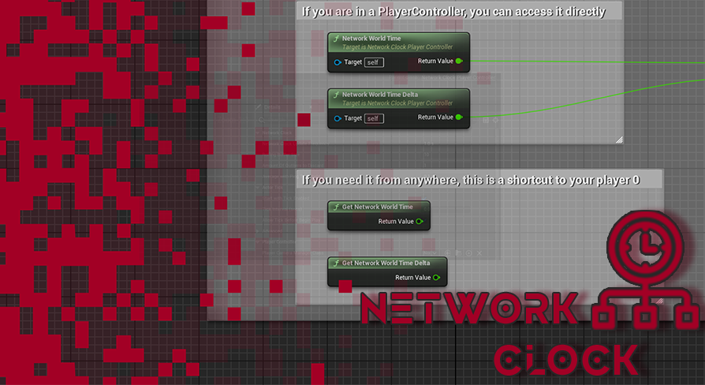
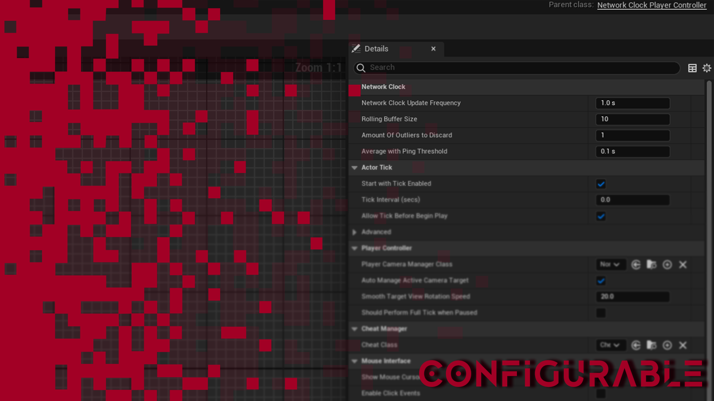
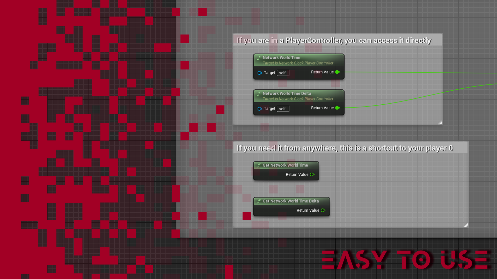

# Network Clock Plugin
### for Unreal Engine
_based on the research by the amazing [Alvaro Jover-Alvarez](https://vorixo.github.io/devtricks/non-destructive-synced-net-clock/) and the community of [Unreal ~~Slackers~~ Source](https://discord.gg/unrealsource)_

Network Clock for Unreal Engine is a solution to address time synchronization challenges in multiplayer games. Designed to seamlessly synchronize client time with server time, it eliminates inaccuracies caused by network latency, ensuring a fair and consistent gaming experience for all players.

This plugin improves Unreal Engine's "GetServerWorldTimeSeconds" by actively synchronizing the client clock, compensating for network latency with client-side techniques, and offering customizable settings for precise time synchronization, ensuring a smoother, more responsive multiplayer gaming experience.

## How to use
1. Extend your Player Controller from "Network Clock Player Controller"  
(This plugin is bundled into a player controller because we need both Server RPCs and Client RPCs. Player Controller is just the most convinient place to do that.) 

2. Configure or leave the default values

3. Use the Network World Time nodes (or `GetNetworkWorldTime` in cpp) to get the networked time.

4. Make the next Fortnite.